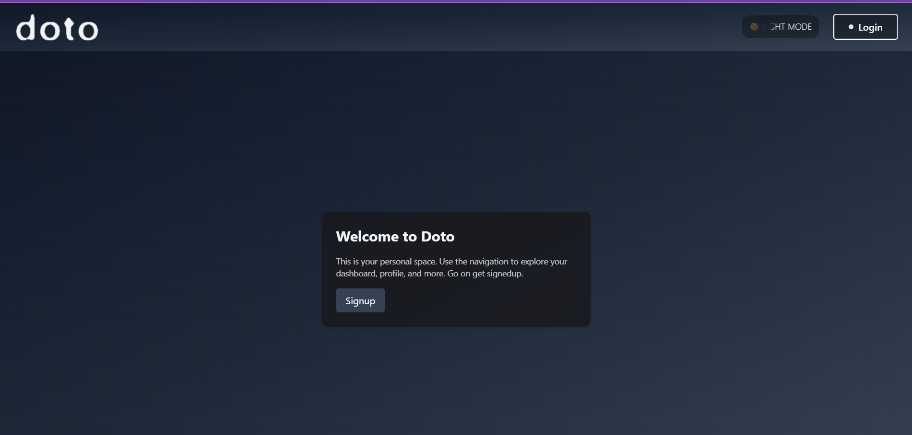
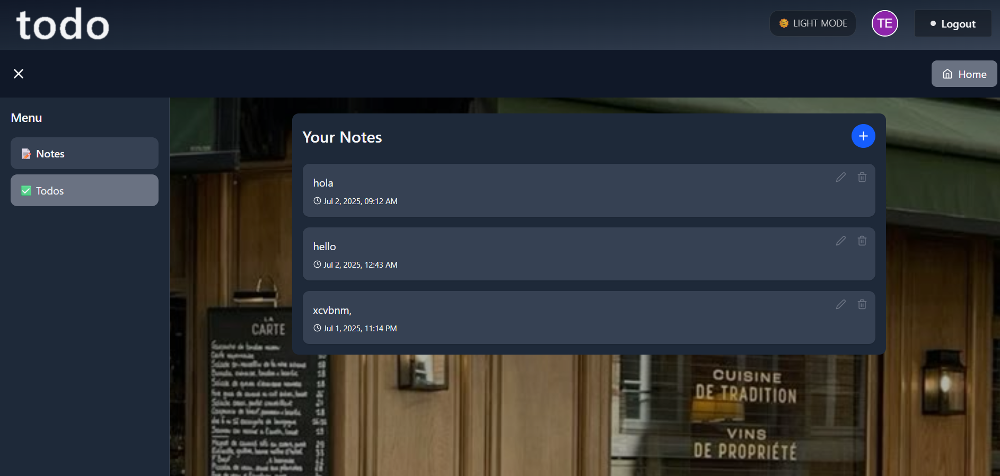
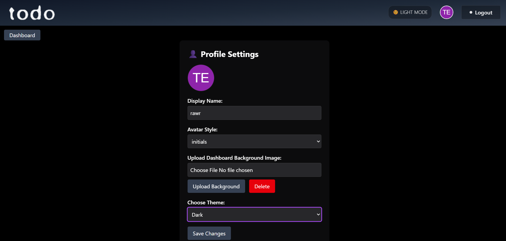
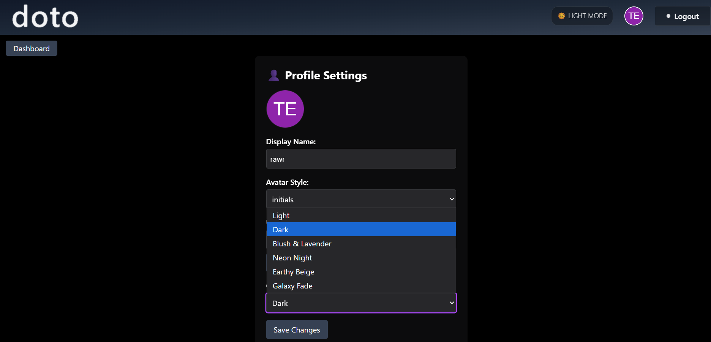
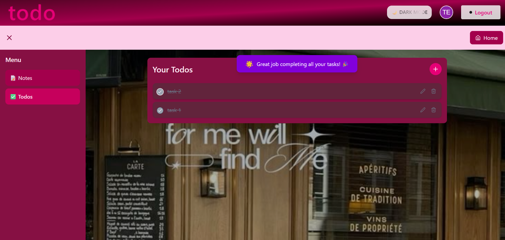

# 🚀 Doto — Your Personalized Productivity Dashboard

Welcome to **Doto**, a beautiful and modern productivity app where you can manage notes and todos, customize themes, and create your own personalized workspace!

## 💡 Author
Aditi Rawat

## 🌟 Features

- 📝 Create and switch between notes and todos
- 🎨 Multiple custom themes (Light, Dark, Neon Night, Galaxy, etc.)
- 🎉  Different Appreciation Message when all tasks are completed.
- 📷 Custom dashboard background images
- ⚡ Smooth sidebar with toggle
- 🔥 Mobile-friendly and responsive
- 💨 Smooth transitions and animated UI
- 💻 Deployed live on Vercel

## 🖥️ Live Demo

[View Live App](https://todo-gamma-pink-27.vercel.app)

## ⚙️ Tech Stack

- React
- Vite
- Firebase Auth & Firestore
- Cloudinary
- Tailwind CSS + Magic UI
- React Icons

## 📸 Screenshots







## 💡 Installation

```bash
git clone https://github.com/aditirawatar/todo.git
cd todo
npm install
npm run dev

